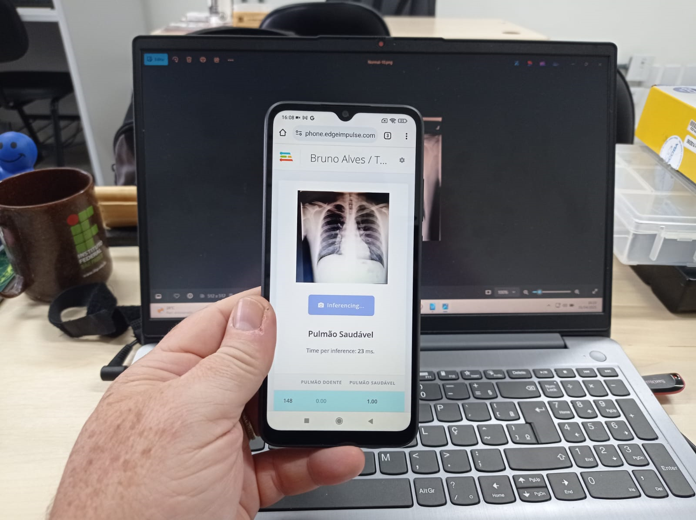

# Passo a Passo no 1º projeto de Inteligência Artificial (IA)!

# Introdução

O roteiro tem como objetivo apresentar a plataforma Edge Impulse,
oferecendo uma introdução aos seus principais recursos e
funcionalidades. Para exemplificar esses conceitos, será desenvolvido um
projeto de classificação para identificar se um pulmão está saudável ou
apresenta sinais de tuberculose, demonstrando na prática como a
plataforma pode ser utilizada para treinar e implementar modelos de
aprendizado de máquina.

## Edge Impulse

Edge Impulse é a plataforma de inteligência artificial que iremos
aprender a usar para a criação do nosso primeiro projeto, com aspectos
interessantes para iniciantes na área, pois, além de ser gratuita, seu
processamento é feito na nuvem, não necessitando de uma máquina potente.
Além disso, é uma IA no-code, ou seja, em nenhum momento da construção
do projeto é necessário escrever códigos, facilitando o processo para
qualquer pessoa sem experiência na área.

# Crie seu projeto

Acesse o site da <a href="https://edgeimpulse.com/">Edge Impulse</a> e
crie sua conta de forma gratuita (Clique no Get Started no canto
superior).

Após a criação da conta, clique no Create New Project e irá aparecer
essa aba:

Escolha o nome do seu projeto, selecione a opção Personal e selecione
Public.

A opção Personal se refere a versão gratuita da plataforma com um limite
de uso do processamento na plataforma.

A diferença entre as opções Public e Private é que a primeira permite
que qualquer usuário na plataforma visualize e clone o seu projeto,
porém sem a possibilidade de editá-lo. Já no modo privado, há uma
limitação de até dois projetos, com a vantagem de que eles não podem ser
visualizados ou clonados por outros usuários.

A grande vantagem da opção Public é a possibilidade de criar projetos
sem limite de quantidade, um benefício que a opção privada não oferece.
Por esse motivo, a preferência é criar um projeto público.

# Aquisição de Dados

Este será o menu que trabalharemos até o final do projeto. Para começar
precisamos obter um conjunto de dados, um dataset, que servirá como
treinamento e teste para nossa IA aprender a identificar se o pulmão é
saudável ou não.

Comece descendo a página e escolha a opção “One label per data item”.
Esta opção define se o nosso projeto é de classificação ou detecção de
objetos. 

  

Clique em Add data e Upload Data.

  

O conjunto de dados que usaremos será imagens de Raio-X de pulmões
saudáveis e pulmões com tuberculose do site
<a href="https://www.kaggle.com/">Kaggle</a> que disponibiliza
gratuitamente o uso dos datasets feitos pela própria comunidade por isso
devemos nos atentar a confiabilidade das imagens.

Com esta problemática de confiabilidade o EAILab possui um
<a href="https://eailab.labmax.org/2024/06/17/datasets-de-acesso-livre-para-projetos-de-i-a/">post</a>
com os conjuntos de dados (datasets) de acesso livre para projetos de IA
mais difundidos.

As imagens estão disponíveis
<a href="https://www.kaggle.com/datasets/tawsifurrahman/tuberculosis-tb-chest-xray-dataset">aqui</a>,
ao acessar faça o download e extraia a pasta zip.

  
  
 

Volte ao Edge Impulse e selecione:

  

Este processo será feito 2 vezes, a primeira vez selecione a pasta
Chest_Radiography_Database e depois a Pasta Normal e coloque o nome
(label) de "Pulmão Saudável" e clique em Upload Data. Na segunda vez abra
novamente esta aba, selecione novamente a Pasta
Chest_Radiography_Database e depois a Pasta Tuberculosis e coloque o
nome de "Pulmão Doente".

Após a coleta de imagens, já é possível criar e treinar nossa IA.
<h2>

# Configure a Inteligência artificial
</h2>

Clique na opção Create Impulse para começar a ajustar a inteligência
artificial e perceberá como é simples o uso da plataforma.

Ao aparecer esta tela, clique em Save. Essas configurações são
necessárias apenas para quem pretende embarcar o projeto em um
processador específico.

  

Neste primeiro bloco, ocorre o tratamento das imagens para que possamos
uniformizá-las em relação ao tamanho. A quantidade de pixels em uma
imagem é um fator crucial, pois cada pixel representa uma informação
adicional. Portanto, é necessário equilibrar essa quantidade, já que um
excesso de pixels pode aumentar o tempo de processamento da IA e
ultrapassar o limite de 20 minutos gratuitos disponíveis na plataforma.

A configuração da altura e largura será 96 pixels e o Resize Mode será
alterado para Squash.

  

Ao lado clique no Add Processing block e selecione a opção Image, a
função deste bloco é fazer o pré-processamento da imagem com um código
já criado pela a própria Edge Impulse.

  

Clique no Add Learning Block e selecione o Transfer Learning, um código
previamente treinado pela própria plataforma fará o ajuste
fino para se enquadrar em nosso projeto.

  

Clique no Impulse Design e clique em Image conforme a seguir.

  

Mude a escala de RGB para GrayScale e clique para salvar os parâmetros.

A escala de cinza reduz a quantidade de informações armazenadas, deste
modo, essa conversão pode diminuir o processamento e simplificar a
extração de características. É preciso tomar cuidado com essa escolha,
pois, dependendo do projeto, poderá diminuir a eficácia dele. No
entanto, como o projeto criado usará imagens de raio-X, não haverá
problema. 

  

Clique em Generate features e espere ficar pronto.

  

Depois, clique em Transfer Learning. Quando a tela aparecer, clique em
Save & Train. 

  

Espere o treinamento ser concluído, costuma levar alguns minutos.

No nosso projeto, não é necessário alterar os parâmetros da rede neural,
porém, é importante compreender esses conceitos. O primeiro é o número
de ciclos de treinamento, conhecido como épocas, que representa a
quantidade de vezes em que todos os dados de treino passam pela rede.

Esse número deve ser ajustado adequadamente, pois um valor muito baixo
pode resultar em um aprendizado insuficiente, enquanto um valor muito
alto pode gerar ruídos.

O segundo conceito é a taxa de aprendizado, que determina a velocidade
de atualização dos pesos da rede, ou seja, a correção do algoritmo na
tentativa de aumentar a eficácia do modelo.

Caso queira aprender mais sobre Redes Neurais, acesse o
<a href="https://eailab.labmax.org/2024/08/13/o-poder-das-cnns-em-aplicacoes-de-ml-envolvendo-identificacao-e-classificacao-de-imagens/">post</a>
no site do EAILab e aprenda sobre rede neural convolucional e suas
aplicações.
<h2>

# Testando a eficácia do projeto
</h2>

A inteligência artificial do nosso projeto já foi treinada e está
pronta. Portanto, nesta fase, iremos testar sua eficácia com imagens
inéditas para a IA. As imagens que serão usadas nesse processo já foram
separadas automaticamente na etapa de Data Acquisition, com uma divisão
de 80% para treiná-la e 20% para testá-la.

Clique em Model Testing, selecione Classify all e aguarde até que o
processo seja concluído.

  

<h2>

Os resultados do nosso projetos foram esses:
</h2>

  
  

Lembre-se de que a inteligência artificial possui um fator de
aleatoriedade, o que pode resultar em pequenas variações nos resultados.
<h2>

# Embarque seu projeto
</h2>

O último passo, então, é realizar o deployment, ou seja, embarcar o
nosso projeto em um dispositivo, carregando o código para que possamos
testá-lo na prática. Dentro da plataforma, existem diversas opções,
sendo as mais usuais a geração de um QR Code para dispositivos móveis, a
utilização da linguagem C# e a programação em Arduino.

O QR code do nosso projeto para escaneamento está disponível abaixo.

Com o seu smartphone, leia o QR-code e aguarde o aplicativo ser instalado.

Abra qualquer foto da base de dados, ou uma imagem nova não utilizada durante a criação da IA. Aponte a câmera do smartphone para a imagem.

*** PARABÉNS! ***

Veja na tela do aparelho o diagnóstico produzido pelo seu primeiro projeto de IA!

Caso queria acessar o
<a href="https://studio.edgeimpulse.com/public/649874/live">link</a>
